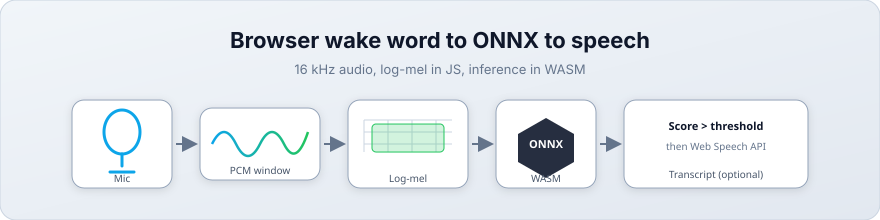
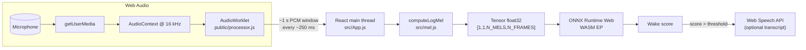
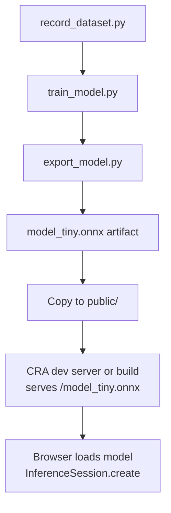

# ONNX Tiny Wake Word

Browser demo that runs a **small ONNX wake-word model** with [ONNX Runtime Web](https://onnxruntime.ai/docs/tutorials/web/) (WASM), matches training-time **log-mel** features in JavaScript, and optionally starts **Web Speech API** transcription after the phrase is detected.

<p align="center">
  
</p>

---

## Contents

- [Workflow diagrams](#workflow-diagrams)
- [Illustrations](#illustrations)
- [Features](#features)
- [Stack](#stack)
- [Requirements](#requirements)
- [Quick start](#quick-start)
- [Model file](#model-file)
- [Scripts](#scripts)
- [Project layout](#project-layout)
- [Training and export (`model_gen`)](#training-and-export-model_gen)
- [Tuning](#tuning)
- [Browser notes](#browser-notes)
- [Troubleshooting](#troubleshooting)

---

## Workflow diagrams

These **Mermaid** diagrams render on [GitHub](https://github.blog/2022-02-14-include-diagrams-markdown-files-mermaid/) and in many Markdown previews (VS Code, etc.).

### In-browser runtime (audio to score)



### Offline: train, export, ship



---

## Illustrations

Vector figures live under [`docs/images/`](docs/images/). They stay sharp at any zoom and work offline in the repo.

**End-to-end runtime pipeline** (same story as the first Mermaid diagram):

<p align="center">
  
</p>

**Offline training path** (`model_gen` to the static site):

<p align="center">
  
</p>

---

## Features

- **16 kHz** microphone capture via `AudioContext` and an **AudioWorklet** that streams ~1 s rolling windows to the main thread.
- **Client-side inference** with `onnxruntime-web` using the **WASM** execution provider for broad compatibility.
- **Log-mel spectrogram** (`src/mel.js`) aligned with `model_gen/train_model.py` (FFT, HTK mel scale, Hann window, etc.).
- **Wake score UI** with a rolling log; above threshold, starts **continuous speech recognition** (where the browser supports it).

Default wake phrase in the UI copy: **“hey boss”** (depends on the model you train and export).

---

## Stack

| Layer        | Choice                          |
| ------------ | ------------------------------- |
| UI           | React 19                        |
| Tooling      | Create React App (`react-scripts` 5) |
| Inference    | `onnxruntime-web` → WASM        |
| Audio        | Web Audio API + AudioWorklet    |
| Transcription| Web Speech API (`SpeechRecognition` / `webkitSpeechRecognition`) |

---

## Requirements

- **Node.js** 18+ recommended (LTS fine).
- **npm** (ships with Node).
- A **`model_tiny.onnx`** (or your exported ONNX) in `public/` so the app can load `/model_tiny.onnx`. See [Model file](#model-file).

---

## Quick start

```bash
git clone <your-repo-url>
cd onnx-tiny-model
npm install
```

Place the ONNX model at `public/model_tiny.onnx`, then:

```bash
npm start
```

Open [http://localhost:3000](http://localhost:3000), allow microphone access, and use **Start Microphone** / **Stop**.

Production build:

```bash
npm run build
```

Serve the `build/` folder over **HTTPS** in production so microphone access is reliable.

---

## Model file

The app loads the model from a **public URL path** (see `src/App.js`):

- Expected path: **`public/model_tiny.onnx`** → served as `/model_tiny.onnx`.

Large or proprietary `.onnx` files are often gitignored. After training or exporting locally, copy the artifact into `public/`:

```bash
cp path/to/model_tiny.onnx public/model_tiny.onnx
```

If you change the filename, update the path passed to `ort.InferenceSession.create(...)`.

---

## Scripts

| Command        | Description                                      |
| -------------- | ------------------------------------------------ |
| `npm start`    | Dev server with hot reload (default port 3000).  |
| `npm run build`| Optimized production bundle into `build/`.       |
| `npm test`     | Jest test runner (interactive watch in dev).     |
| `npm run eject`| Irreversible CRA eject — only if you need it.    |

---

## Project layout

```text
onnx-tiny-model/
├── docs/
│   └── images/           # SVG diagrams for README
├── public/
│   ├── index.html
│   ├── processor.js      # AudioWorklet: 16 kHz ring buffer → main thread
│   └── model_tiny.onnx   # add locally (not always in git)
├── src/
│   ├── App.js            # ONNX session, mic, inference, speech recognition
│   ├── mel.js            # log-mel features for the model input tensor
│   ├── index.js
│   └── …
├── model_gen/            # Python: data, train, export ONNX
│   ├── train_model.py
│   ├── export_model.py
│   ├── record_dataset.py
│   └── requirements.txt
├── package.json
└── README.md
```

---

## Training and export (`model_gen`)

Python utilities live under **`model_gen/`**. Typical flow:

1. Install deps (prefer a virtualenv):

   ```bash
   cd model_gen
   pip install -r requirements.txt
   ```

2. Record data, train, and export per your scripts (`record_dataset.py`, `train_model.py`, `export_model.py`). Generated artifacts such as `model.onnx` / `model_tiny.onnx` may be listed in `.gitignore`.

3. Copy the exported ONNX the web app expects into **`public/`**.

Keep **sample rate (16 kHz)**, **mel dimensions**, and **frame count** consistent between `model_gen` training and `src/mel.js` exports (`N_MELS`, `N_FRAMES`, etc.).

---

## Tuning

- **Detection threshold**: `WAKE_WORD_THRESHOLD` in `src/App.js` (default `0.9`). Lower values increase sensitivity and false accepts.
- **Execution provider**: currently **`wasm`** in `InferenceSession.create`. You can experiment with WebGL or other providers supported by your build of `onnxruntime-web`, at the cost of compatibility or bundle size.

---

## Browser notes

- **Microphone**: Requires a [secure context](https://developer.mozilla.org/en-US/docs/Web/Security/Secure_Contexts) (HTTPS or `localhost`).
- **Speech transcription**: Uses the **Web Speech API**, which is **not implemented uniformly** across browsers; Chromium-based browsers often expose `webkitSpeechRecognition`. If unavailable, wake-word scoring still works; transcript features are skipped with a log message.
- **AudioWorklet**: Served from `public/processor.js`; the dev server must be able to load it from the same origin as the app.

---

## Troubleshooting

| Symptom | Things to check |
| ------- | ---------------- |
| Model fails to load | `public/model_tiny.onnx` exists; path in `App.js` matches; browser devtools **Network** tab for 404. |
| No microphone | Permissions; HTTPS (not file://); no other tab locking the device. |
| Scores look wrong | Training feature pipeline vs `mel.js` mismatch (rates, FFT, hop, mel count, frames). |
| ONNX runtime errors | Input tensor name/shape matches the exported model (`input` / shape `[1, 1, N_MELS, N_FRAMES]` in current code). |

---

## Contributing

Issues and pull requests are welcome. For larger changes, open an issue first so approach and model contract stay aligned.

---

## Acknowledgements

- [ONNX Runtime](https://onnxruntime.ai/)
- [Create React App](https://create-react-app.dev/)
